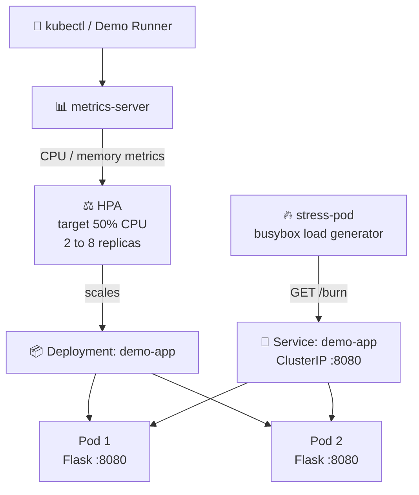
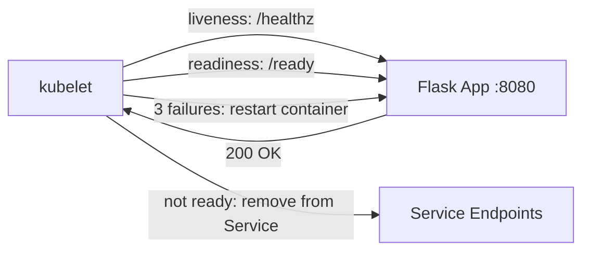

# K8s Self-Healing & Autoscaling Demo


A hands-on lab that shows how Kubernetes **recovers from failures automatically** and **scales horizontally under load**. It uses a real Flask app, real health probes, a real Horizontal Pod Autoscaler (HPA), and real failure injection. Built with Python (Flask), Docker, Kubernetes, and kind.

---

## 📌 Project Idea

The goal is to *prove* that Kubernetes heals and scales without human intervention, instead of just describing it. The project has four demos:

1. **Pod deletion**: the ReplicaSet replaces a deleted pod.
2. **Process crash**: the liveness probe restarts a hung container.
3. **Load spike**: the HPA scales the app from 2 to 8 replicas.
4. **Load drop**: the HPA scales back down safely.

A small Flask app exposes endpoints that trigger each behavior on demand, so every scenario can be reproduced with one command.

---

## 🏗️ Architecture & Workflow

### High-Level Workflow



### Health Probes per Pod



---

## 📊 What This Project Demonstrates

| Capability | Mechanism | What You Will See |
|---|---|---|
| Pod replacement | ReplicaSet controller | Deleted pod is replaced in about 2 seconds |
| Container restart | Liveness probe | Hung container restarts after 3 failed checks |
| Traffic gating | Readiness probe | Pod is `Running` but not `Ready` for about 8 seconds |
| Autoscaling | HPA + metrics-server | Replicas scale 2 → 8 when CPU exceeds 50% |
| Scale-down safety | HPA stabilization window | Replicas drop back to 2 after 60 seconds of low load |

---

## 🧰 Tech Stack

- **Application**: Python 3.12, Flask 3.0
- **Containerization**: Docker (non-root image, exec-form CMD)
- **Orchestration**: Kubernetes (kind cluster)
- **Autoscaling**: Horizontal Pod Autoscaler + metrics-server
- **Load Generation**: busybox pod
- **Scripting**: Bash

---

## 📁 Project Structure

```
K8s-Self-Healing-Autoscaling/
├── app/
│   ├── app.py                   # Flask app: /healthz, /ready, /burn, /crash
│   ├── requirements.txt         # Pinned dependencies
│   └── Dockerfile               # Non-root, unbuffered, exec-form CMD
├── k8s/
│   ├── namespace.yaml           # `demo` namespace
│   ├── deployment.yaml          # 2 replicas, probes, resource requests/limits
│   ├── service.yaml             # ClusterIP on port 8080
│   ├── hpa.yaml                 # CPU-based HPA, 2 to 8 replicas
│   └── stress-pod.yaml          # busybox load generator
├── scripts/
│   ├── setup-cluster.sh         # kind cluster + build + apply
│   ├── install-metrics-server.sh
│   └── demo-runbook.sh          # Interactive 4-scenario walkthrough
├── DEMO-CHECKLIST.md            # Step-by-step demo runbook
├── LICENSE
└── README.md
```

---

## 🔌 Application Endpoints & Port Mapping

| Endpoint | Purpose | Behavior |
|---|---|---|
| `GET /healthz` | Liveness probe | Returns `200` while the process is alive |
| `GET /ready` | Readiness probe | Returns `503` for the first 8 seconds, then `200` |
| `GET /burn` | CPU load generator | Burns CPU for 30 seconds |
| `GET /crash` | Failure simulator | Calls `os._exit(1)` to kill the process |

| Component | Port |
|---|---|
| Flask container | `8080` |
| Service (ClusterIP) | `8080` (internal only) |

The 8-second readiness delay simulates real-world slow startup (database connections, cache warm-up, model loading), so you can see the readiness probe gate traffic.

---

## 🚀 How to Run on Your Machine

### Prerequisites

- Docker
- [minikube](https://minikube.sigs.k8s.io/docs/start/) (kind or MicroK8s also work)
- [kubectl](https://kubernetes.io/docs/tasks/tools/)
- At least 8 GB RAM

### Step 1: Clone the Repository

```bash
git clone https://github.com/shubhamnishane-064/K8s-Self-Healing-Autoscaling.git
cd K8s-Self-Healing-Autoscaling
```

### Step 2: Create the Cluster and Deploy

```bash
chmod +x scripts/*.sh
./scripts/setup-cluster.sh
```

### Step 3: Install metrics-server (Required for HPA)

```bash
./scripts/install-metrics-server.sh
```

### Step 4: Verify the App Is Running

```bash
kubectl get pods -n demo -w
```

Expected output after about 30 seconds:

```
NAME                        READY   STATUS    RESTARTS   AGE
demo-app-6b8c9d7f4-abc12    1/1     Running   0          30s
demo-app-6b8c9d7f4-def34    1/1     Running   0          30s
```

---

## 🎬 Demo Scenarios

Run all four automatically:

```bash
./scripts/demo-runbook.sh
```

Or run them one at a time:

### Demo 1: ReplicaSet Self-Healing

```bash
# Terminal A: watch pods
kubectl get pods -n demo -w

# Terminal B: delete a pod
kubectl delete pod -n demo -l app=demo-app --wait=false
```

**Expected:** the deleted pod goes `Terminating` and a new pod is `Running` within about 2 seconds. `RESTARTS` stays `0` because this is the ReplicaSet controller, not a liveness restart.

### Demo 2: Liveness Probe Recovery

```bash
POD=$(kubectl get pods -n demo -l app=demo-app -o jsonpath='{.items[0].metadata.name}')
kubectl exec -n demo "$POD" -- \
  python -c "import urllib.request; urllib.request.urlopen('http://localhost:8080/crash')"
```

**Expected:** after about 30 seconds (3 failed probes x 10s interval), `RESTARTS` goes from `0` to `1`.

### Demo 3: HPA Scale-Up Under Load

```bash
# Terminal A
kubectl get hpa -n demo -w

# Terminal B
kubectl get pods -n demo -w

# Terminal C
kubectl apply -f k8s/stress-pod.yaml
```

**Expected timeline:**

| Time | Replicas | CPU | Event |
|---|---|---|---|
| 0s | 2 | ~10% | Baseline |
| 30s | 2 | ~55% | HPA detects threshold breach |
| 45s | 4 | ~30% | First scale-up |
| 90s | 6 | ~25% | Further scale-up |
| 180s | 6 to 8 | varies | Steady state |

### Demo 4: HPA Scale-Down After Load

```bash
kubectl delete pod cpu-stressor -n demo --ignore-not-found
kubectl get hpa -n demo -w
```

**Expected:** CPU drops to about 5%. After the 60-second `stabilizationWindowSeconds`, replicas return to `2`.

---

## ⚙️ Configuration Reference

### Probes (`k8s/deployment.yaml`)

```yaml
livenessProbe:
  httpGet: { path: /healthz, port: 8080 }
  initialDelaySeconds: 15   # buffer above the 8s startup time
  periodSeconds: 10
  failureThreshold: 3       # about 30s of failure tolerance

readinessProbe:
  httpGet: { path: /ready, port: 8080 }
  initialDelaySeconds: 5
  periodSeconds: 5
  failureThreshold: 2       # fail fast, keep traffic away from unready pods
```

**Why these values**

- **Liveness delay is longer than startup time**, otherwise kubelet kills the container before it finishes initializing (a classic crash-loop bug).
- **Readiness checks sooner and fails faster**, because traffic routing is more sensitive than restarts.
- **`threaded=True` in Flask**, otherwise `/burn` blocks `/healthz` and causes false restarts.

### HPA (`k8s/hpa.yaml`)

```yaml
minReplicas: 2
maxReplicas: 8
metrics:
- type: Resource
  resource:
    name: cpu
    target:
      type: Utilization
      averageUtilization: 50
behavior:
  scaleUp:
    stabilizationWindowSeconds: 0     # react instantly
  scaleDown:
    stabilizationWindowSeconds: 60    # avoid flapping
```

- The HPA compares usage against `resources.requests.cpu`, **not** limits.
- The 60-second scale-down window prevents thrashing during short load dips.

---

## 🛠️ Troubleshooting

| Symptom | Cause | Fix |
|---|---|---|
| `Metrics API not available` | metrics-server not installed | Run `install-metrics-server.sh`, wait about 30s |
| HPA shows `<unknown>` for CPU | Pods missing `resources.requests.cpu` | Set CPU requests in the deployment |
| `CrashLoopBackOff` | Liveness probe kills container during startup | Increase `initialDelaySeconds` |
| Pods never `Ready` | `/ready` keeps returning 503 | Check `STARTUP_DELAY_SECONDS` env and pod logs |
| `/burn` triggers restarts | Flask not running threaded | Confirm `threaded=True` in `app.run(...)` |
| Empty `kubectl logs` | Python buffering stdout | `PYTHONUNBUFFERED=1` (already in the Dockerfile) |

---

## 💡 Key Design Decisions

1. **Liveness and readiness are separate.** Liveness restarts hung containers, readiness gates traffic. Mixing them up is the most common Kubernetes health-check mistake.
2. **HPA needs resource requests.** Utilization is `usage / request`, so without requests the HPA cannot calculate anything.
3. **Health endpoints must never block.** Long-running handlers run in their own thread so probes still respond under load.
4. **Container-friendly Python.** `PYTHONUNBUFFERED=1` gives real-time logs, and an exec-form `CMD` delivers SIGTERM correctly.
5. **Non-root container.** A cheap change that matches most production cluster policies.
6. **Fast scale-up, cautious scale-down.** Stabilization windows prevent flapping.
7. **Real failure injection.** Pod deletions and process crashes hit an actual cluster, so the recovery is genuine.

**Tradeoff:** the HPA reacts in about 30 to 60 seconds. For sub-second SLAs, combine it with KEDA, Karpenter, or a queue-based autoscaler.

---

## 🧹 Cleanup

```bash
kubectl delete namespace demo
kind delete cluster --name demo-cluster
```

---

## 👤 Author

**Shubham Nishane**

- GitHub: [@shubhamnishane-064](https://github.com/shubhamnishane-064)
- LinkedIn: [Shubham Nishane](https://www.linkedin.com/in/shubham-nishane-2b340b416)

---

---

## 🙏 Acknowledgements

- [Kubernetes HPA documentation](https://kubernetes.io/docs/tasks/run-application/horizontal-pod-autoscale/)
- [kind](https://kind.sigs.k8s.io/) for local clusters
- [metrics-server](https://github.com/kubernetes-sigs/metrics-server) for resource metrics
- [Flask](https://flask.palletsprojects.com/) for the lightweight web framework

---

**Happy Learning!** 🚀
